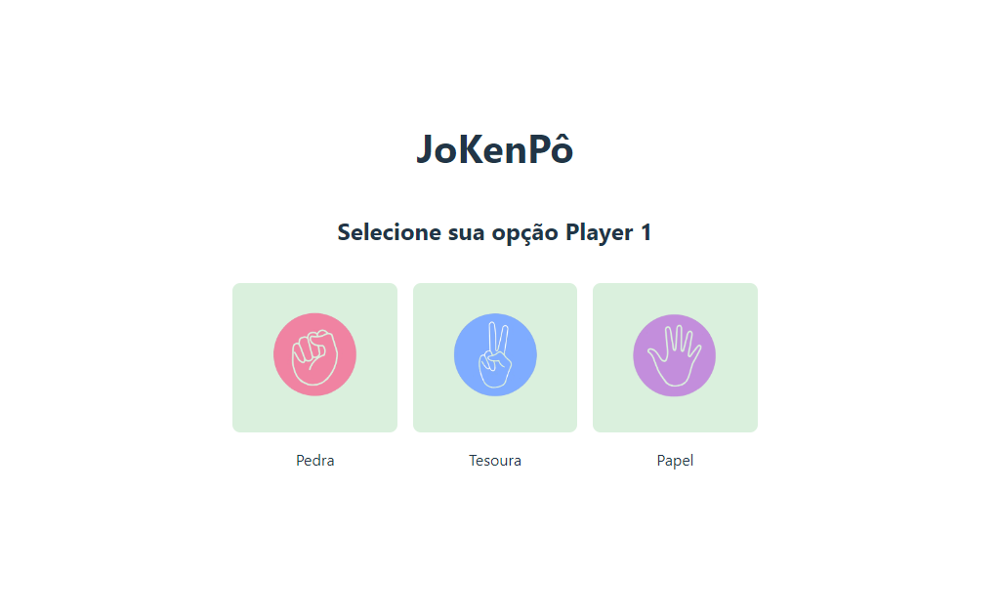

# Projeto JoKenPô

  Jogo de pedra-papel-tesoura (do japonês じゃんけんぽん, jankenpon), também chamado em algumas regiões do Brasil de **jokenpô** é um jogo de mãos recreativo e simples.

  Neste jogo, os competidores devem escolher um símbolo (pedra, papel ou tesoura) e clicar na contagem regressiva para ver quem ganhou disputa.

## Regras

- Pedra ganha da tesoura (amassando-a ou quebrando-a).
- Tesoura ganha do papel (cortando-o).
- Papel ganha da pedra (embrulhando-a).
- Caso dois jogadores façam o mesmo gesto, ocorre um empate.
